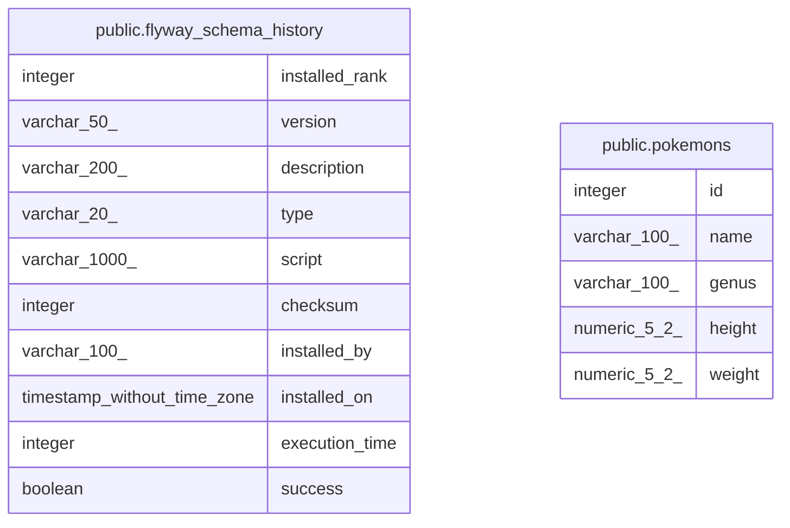

# pokemondb

## Tables

| Name | Columns | Comment | Type |
| ---- | ------- | ------- | ---- |
| [public.flyway_schema_history](public.flyway_schema_history.md) | 10 |  | BASE TABLE |
| [public.pokemons](public.pokemons.md) | 5 | ポケモン基本マスタ | BASE TABLE |

## Relations

---

> Generated by [tbls](https://github.com/k1LoW/tbls)
