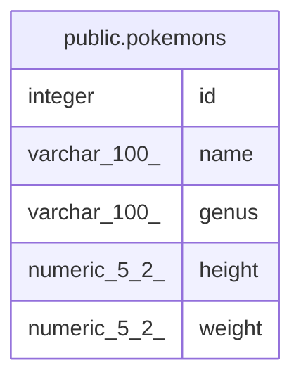

# public.pokemons

## Description

ポケモン基本マスタ

## Columns

| Name | Type | Default | Nullable | Children | Parents | Comment |
| ---- | ---- | ------- | -------- | -------- | ------- | ------- |
| id | integer |  | false |  |  |  |
| name | varchar(100) |  | false |  |  | ポケモン名 |
| genus | varchar(100) |  | true |  |  |  |
| height | numeric(5,2) |  | true |  |  |  |
| weight | numeric(5,2) |  | true |  |  |  |

## Constraints

| Name | Type | Definition |
| ---- | ---- | ---------- |
| pokemons_pkey | PRIMARY KEY | PRIMARY KEY (id) |

## Indexes

| Name | Definition |
| ---- | ---------- |
| pokemons_pkey | CREATE UNIQUE INDEX pokemons_pkey ON public.pokemons USING btree (id) |

## Relations

---

> Generated by [tbls](https://github.com/k1LoW/tbls)
